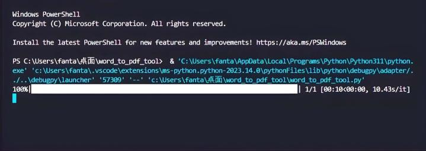

# Word 轉 PDF 工具

這是一個使用 Python 和 Tkinter 構建的 GUI 工具，用於將 Word 文件轉換為 PDF 文檔。使用者可以將要轉換的 Word 文件拖放到界面上，選擇轉換後的輸出路徑，然後進行轉換操作。

## 功能簡介

- 拖放 Word：通過將 Word 文件拖放到標籤上，實現文件的拖放操作。
- 開始轉換：拖放 Word 後，將 Word 文件轉換為 PDF 文檔。
- 轉換提示：轉換完成後，會顯示提示框，通知使用者轉換已完成。

## 範例演示




## 使用方法

1. 在終端或命令提示符中，使用以下命令運行 `word_to_pdf_tool.py` 程序文件。

2. 程序窗口將打開，包含以下功能：
   - `將 Word 文件拖放到此處`
   - `開始轉換`
   - `轉換提示`

3. 拖放 Word 後 Word 文件轉將轉換為 PDF 文檔。

4. 轉換完成後，會顯示提示框，通知使用者轉換已完成。

## 環境要求

- Python 3.x 版本
- Tkinter 庫
- docx2pdf 庫
- tkinterdnd2 庫

## 安裝步驟

1. 使用 `git clone` 命令或下載 ZIP 壓縮檔，將程式複製到您的計算機中。

2. 在命令提示符中，進入程式所在的資料夾。

3. 使用以下命令安裝必要的庫：
    ```
    pip install tkinter
    ```

    ```
    pip install docx2pdf
    ```

    ```
    pip install tkinterdnd2
    ```

4. 使用以下命令運行程式：
    ```
    python word_to_pdf_tool.py
    ```

## 授權信息

本程式遵循 [MIT 授權](LICENSE.txt)，您可以自由使用、修改和分享本程式。